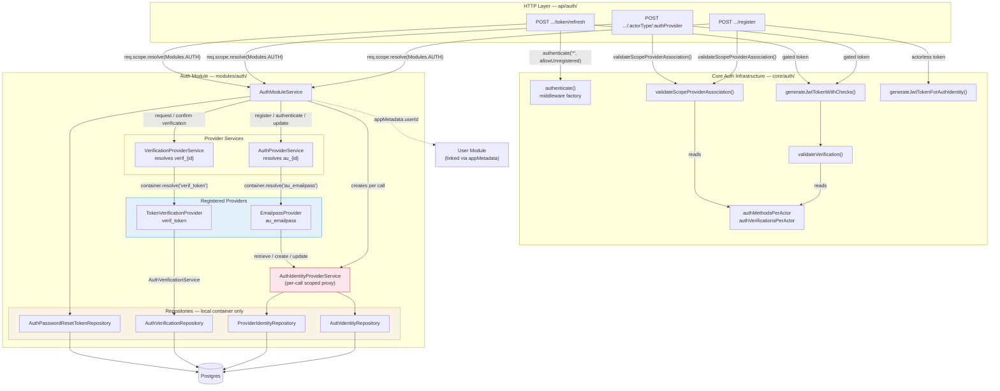
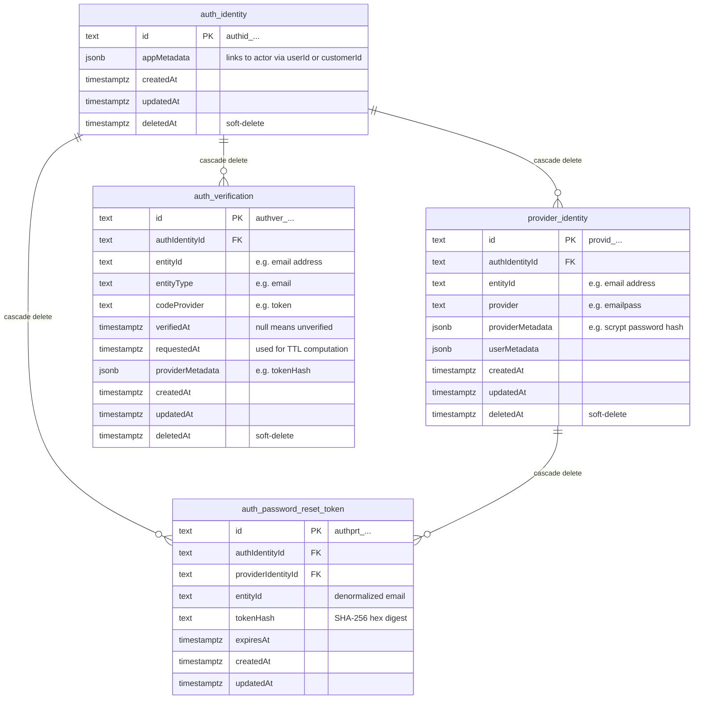
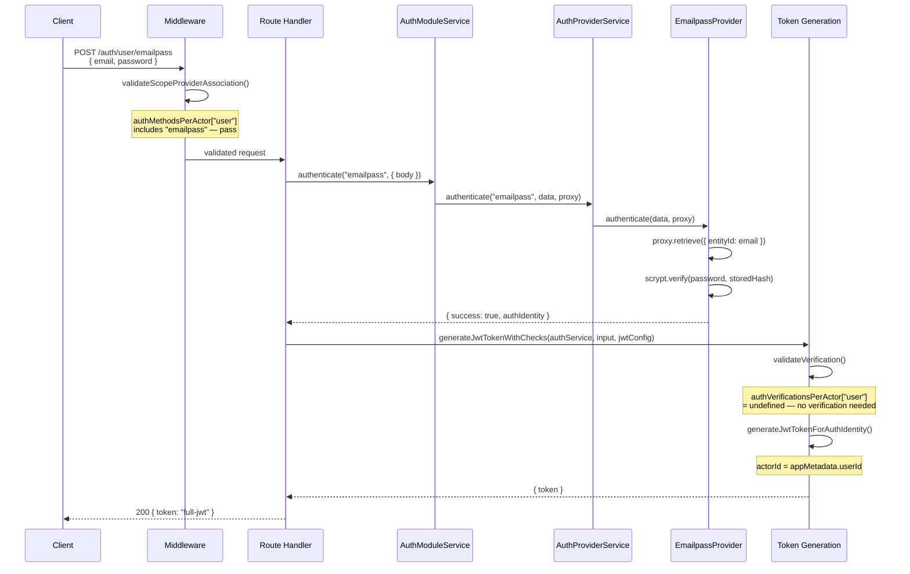
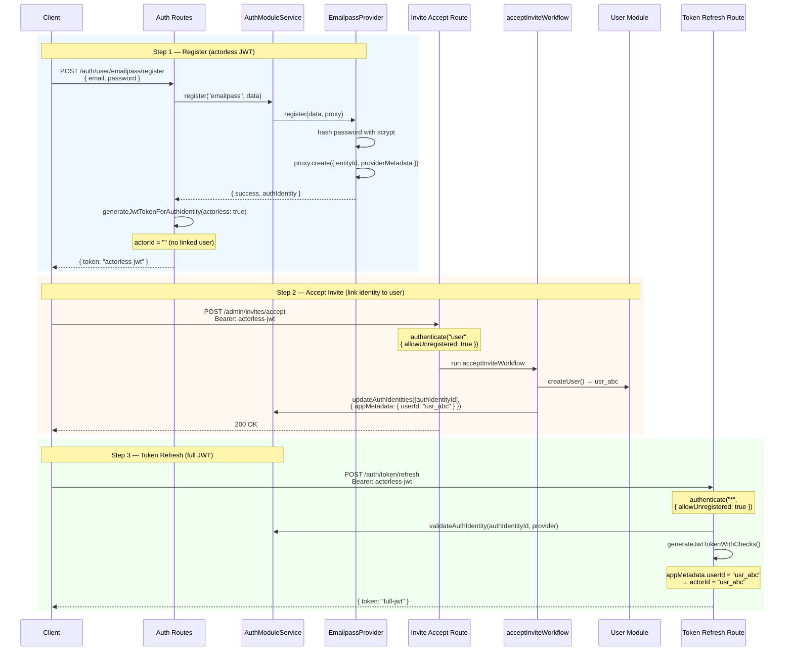
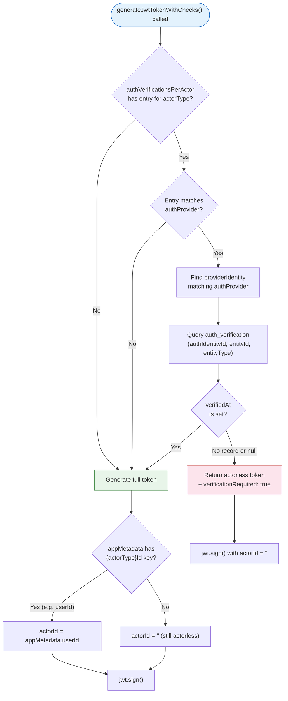
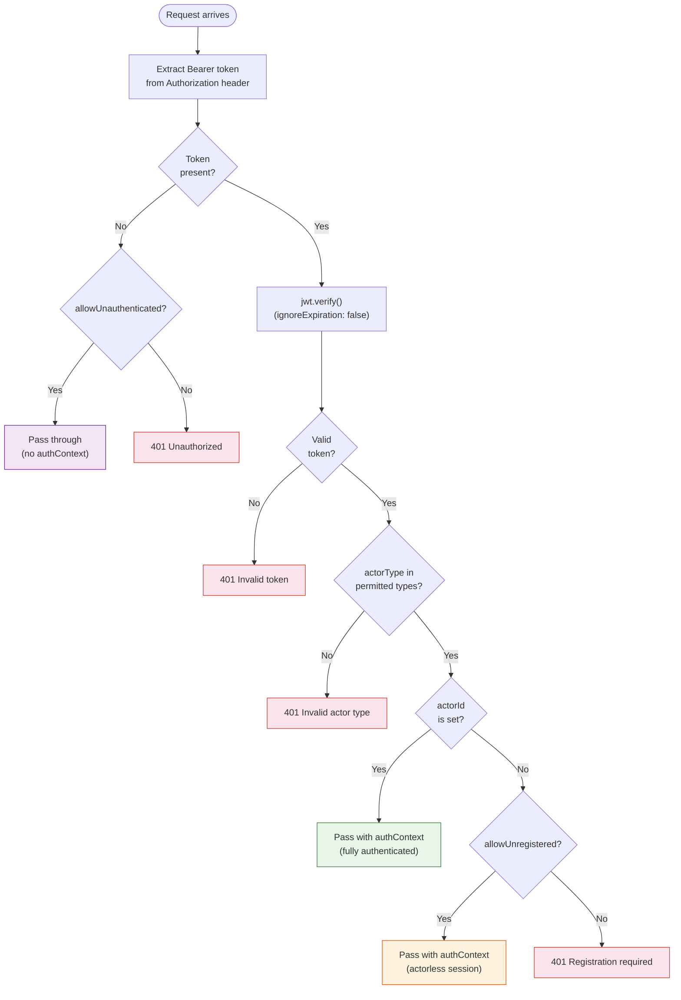

# Auth Module Architecture

Visual companion to the [full MVP spec](./auth-module-mvp-spec.md). Read this first for the mental model, then dive into the spec for implementation details.

## System Overview

Three layers with strict boundaries. Repositories are private to the auth module's local container — only `AuthModuleService` is exposed to the shared container.

**Key boundaries:**

| Boundary | What crosses it | What doesn't |
|----------|----------------|--------------|
| Shared container | `AuthModuleService` | Repositories, providers, internal services |
| Provider API | `AuthIdentityProviderService` proxy (retrieve, create, update) | Repository instances, DB connection |
| Verification provider API | `AuthVerificationService` (list, create, update) | Direct repository access |

## Data Model

| Convention | Details |
|------------|---------|
| ID prefixes | `authid_`, `provid_`, `authver_`, `authprt_` (SQL-generated, ADR 0003) |
| Soft-delete | `auth_identity`, `provider_identity`, `auth_verification` have `deletedAt`. BaseRepository auto-filters. |
| Hard-delete | `auth_password_reset_token` has no `deletedAt`. Transient security tokens are physically deleted on consumption. |
| Partial unique indexes | `provider_identity(entityId, provider) WHERE deletedAt IS NULL` — one active identity per email per provider |
| | `auth_verification(authIdentityId, entityId, entityType) WHERE deletedAt IS NULL` — one active verification per entity |

## Provider Routing

Auth providers never see repositories. They interact with identity data through a scoped proxy created fresh on every call.

```mermaid
flowchart LR
  Route["Route handler
  POST .../register"]

  Route -->|"authService.register('emailpass', data)"| AMS["AuthModuleService"]
  AMS -->|"1. Build scoped proxy"| Proxy["AuthIdentityProviderService
  closes over provider='emailpass'
  methods: retrieve, create, update"]
  AMS -->|"2. Delegate to provider service"| APS["AuthProviderService"]
  APS -->|"container.resolve('au_emailpass')"| EP["EmailpassProvider"]
  EP -->|"3. Provider calls proxy"| Proxy
  Proxy -->|"4. Proxy calls repos"| Repos["authIdentityRepository
  providerIdentityRepository"]
  Repos --> DB[("Postgres")]

  style Proxy fill:#fce4ec,stroke:#c0392b
```

**Why a proxy?** The `AuthIdentityProviderService` is an inline object (not a DI service) because each call needs a different `provider` scope. This is what makes auth providers extractable to standalone packages — they depend on the proxy interface, not on module internals.

## Request Flows

### Login (Happy Path — Admin User)

Admin users (`actorType: "user"`) have no verification requirement in the default config. Login returns a full JWT in one call.

### Invite-Based Admin Signup (3 HTTP Calls)

Registration produces an actorless JWT. The invite-accept workflow links the identity to a user. Token refresh picks up the link and returns a full JWT.

### Token Gating Decision Tree

How `generateJwtTokenWithChecks` decides between returning a full token or an actorless token with `verificationRequired: true`.

## Authenticate Middleware Decision Tree

How the `authenticate()` middleware factory resolves `req.authContext`.

## Key Files

| Concept | File |
|---------|------|
| **Auth module definition** | `modules/auth/index.ts` |
| **AuthModuleService** | `modules/auth/services/auth-module-service.ts` |
| **AuthProviderService** | `modules/auth/services/auth-provider-service.ts` |
| **VerificationProviderService** | `modules/auth/services/verification-provider-service.ts` |
| **Provider loader** | `modules/auth/loaders/providers.ts` |
| **EmailpassProvider** | `providers/auth-emailpass/emailpass.ts` |
| **Models** | `modules/auth/models/auth-identity.ts`, `provider-identity.ts`, `auth-verification.ts`, `auth-password-reset-token.ts` |
| **authenticate() middleware** | `core/auth/middleware/authenticate.ts` |
| **generateJwtToken** | `core/auth/utils/token.ts` |
| **generateJwtTokenWithChecks** | `core/auth/utils/generate-jwt-token.ts` |
| **validateVerification** | `core/auth/utils/validate-verification.ts` |
| **validateScopeProviderAssociation** | `core/auth/utils/validate-scope-provider-association.ts` |
| **Auth config** | `core/auth/config.ts` |
| **AuthContext type** | `core/auth/types.ts` |
| **Route: register** | `api/auth/[actorType]/[authProvider]/register/route.ts` |
| **Route: authenticate** | `api/auth/[actorType]/[authProvider]/route.ts` |
| **Route: token refresh** | `api/auth/token/refresh/route.ts` |
| **Route middleware config** | `api/auth/middlewares.ts` |
| **HTTP schemas** | `packages/http-schemas/src/auth/` |

All paths relative to `apps/backend/src/`.

## What's Not Built Yet

These are defined in the spec but not yet implemented:

- **Password reset flow** — `POST .../reset-password` and `POST .../update` routes, `validateToken` middleware, `createPasswordResetToken` / `consumePasswordResetToken` service methods
- **Email verification flow** — `POST /auth/verification/request` and `POST /auth/verification/confirm` routes, token verification provider (`verif_token`)
- **Notification module integration** — Verification codes and reset JWTs are returned to the route handler but have no email delivery path yet
- **Customer self-signup flow** — `POST /store/customers` route with `createCustomerAccountWorkflow`
- **OAuth providers** — Architecture supports them, none ship with MVP

See the full spec's [Out of Scope](./auth-module-mvp-spec.md#out-of-scope) and [Email Delivery (TODO)](./auth-module-mvp-spec.md#email-delivery-todo-notification-module) sections.
